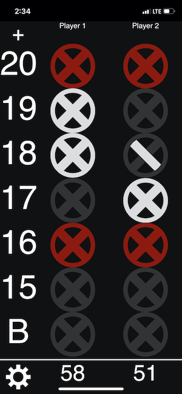

# scoring.games

This was my first foray into Elm. For now, it is just an app keeping score in
Cricket Dart Games. One day I hope to add generic scorepads, or mini-golf
scorepads or really any games where I wish I had a scorepad.

Some things of note:
- Built with [create-elm-app](create-elm-app.md).
- Deployed on [Netlify](https://www.netlify.com/).
